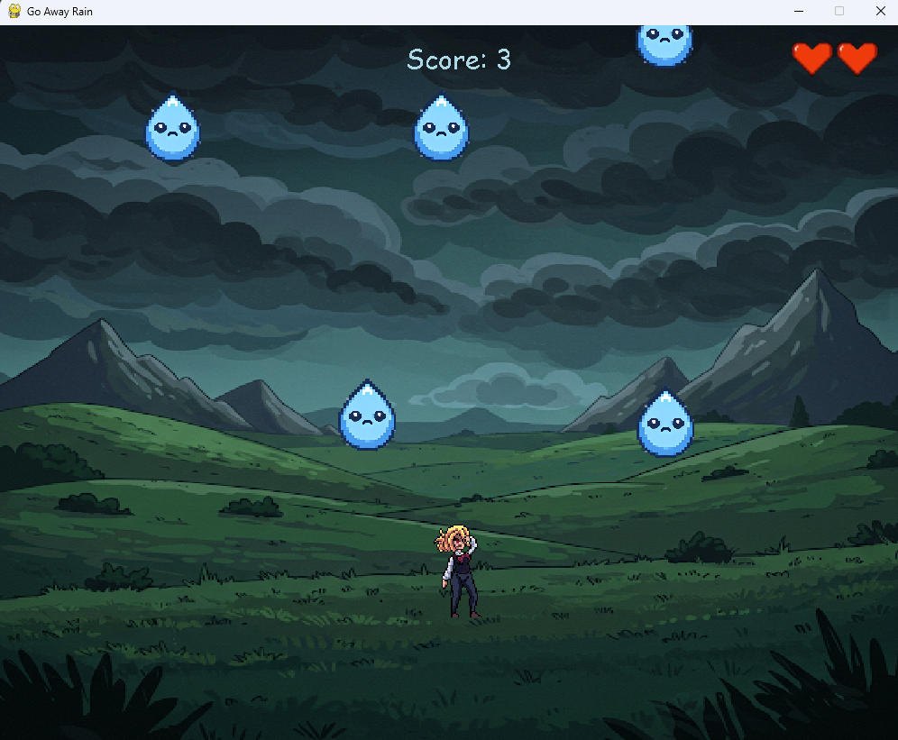

# Go Away Rain

A small arcade game built with Python and Pygame.

## Features
- Sprite-sheet player animations
- Falling rain and collision detection
- Health system
- Splash effects
- Scoring
- Sound effects and music
- Standalone Windows build support

## Controls
- A / D or Arrow Keys: Move

## Running

pip install -r requirements.txt
python main.py

